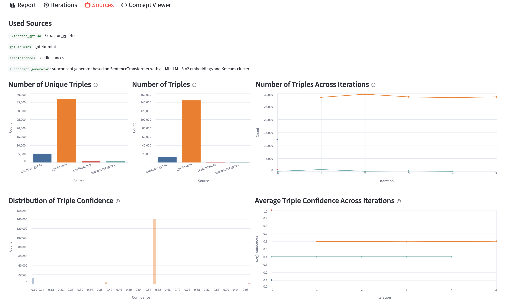

# DySECT: A Dynamic Self-Evolving Extraction System
DySECT implements a closed-loop Information Extraction (IE) system where structured knowledge accumulation in Knowledge Base (KB) progressively enhance extraction and as a result enhances the KB.

## 🎬 Demo Video
Below is a short demo showing how we explore, monitor, and annotate the evolving knowledge base. This interface is an essential component for ensuring transparency and preventing knowledge drift:

[](https://youtu.be/JVGCr5_9pYQ)

## 🏛️ System Architecture
DySECT is implemented in pure Python.

- **Extraction Layer**: Uses API calls to the LLM of choice.
- **Knowledge Base**: Built on top of [Theo: A Framework for Self-Improving Systems (Mitchell et al.)](https://www.taylorfrancis.com/chapters/edit/10.4324/9781315807843-14/theo-framework-self-improving-systems-tom-mitchell-john-allen-prasad-chalasani-john-cheng-oren-etzioni-marc-ringuette-jeffrey-schlimmer).
- **KB Monitoring & Annotation Interface**: Implemented using Streamlit for exploration, validation, and manual control.

## ▶️ Getting Started

### Prerequisites
- Python 3.11+
- Conda

### 📦 Installation
Either locally or on a remote server, set up the Conda environment:

```bash
# Create environment
conda env create -f environment.yml
conda activate extraction

# (Optional) Download spaCy English model
python -m spacy download en_core_web_lg
```

## 🚀 Usage

### Extraction
For the extraction you can specify your LLM of choice with proper API keys and prompt selction version (positive vs negative, different types of prompt templates etc.) along with the path to text data that you want to run extraction on and run extract_with_kb_fireworks.py. The results of extractions would be stored as JSON in the given output directory.

### Knowledge Base
To ingest the extractions into the KB we need to first adjust the extractions into a particular `.tsv` format. for that we use `llm-extractor/scripts/adjust_triples_dysect.py` pointed to the extractions directory.

Now to run the code for putting information into KB we adjust parameters.json to point to the appropriate KBID, directories, and configurations to be used for that KB and then run `kbScripts/kbManagement.py`. This may take soem time as the KB is getting the triples, with all the prevelence infromation, calculating confidence scores, and accumulating with new subconcepts and mutually exclusive relations.

You can find a sample KB in kbs/kbs/demo_acl_2026_run_dec_25_2025 after you `unzip` the provided file.

### KB Monitor and Annotation

Start the Streamlit app
```bash
conda activate extraction
python -m streamlit run app/main.py
```
or with cached KBs (will load any KBs that have already been scanned and cached, and scan the rest as needed):
```bash
bash run_app.sh
```

If successful, you will see a message like:
```
  You can now view your Streamlit app in your browser.

  Local URL: http://localhost:8501
  Network URL: http://10.x.x.x:8501
  External URL: http://y.y.y.y:8501
```

### Access the App
Once the SSH connection is established and the port forwarding is active, open your browser and go to [http://localhost:8501](http://localhost:8501).

## 📄 License

This project is licensed under the BSD 3-Clause License - see the [LICENSE.txt](LICENSE.txt) file for details.

## Disclosures:

This software may include, incorporate, or access open source software (OSS) components, datasets and other third party components, including those identified below. The license terms respectively governing the datasets and third-party components continue to govern those portions, and you agree to those license terms may limit any distribution, use, and copying. You may use any OSS components under the terms of their respective licenses, which may include BSD 3, Apache 2.0, and other licenses. In the event of conflicts between Megagon Labs, Inc. (“Megagon”) license conditions and the OSS license conditions, the applicable OSS conditions governing the corresponding OSS components shall prevail. You agree not to, and are not permitted to, distribute actual datasets used with the OSS components listed below. You agree and are limited to distribute only links to datasets from known sources by listing them in the datasets overview table below. You agree that any right to modify datasets originating from parties other than Megagon are governed by the respective third party’s license conditions. You agree that Megagon grants no license as to any of its intellectual property and patent rights. THIS SOFTWARE IS PROVIDED BY THE COPYRIGHT HOLDERS AND CONTRIBUTORS (INCLUDING MEGAGON) “AS IS” AND ANY EXPRESS OR IMPLIED WARRANTIES, INCLUDING, BUT NOT LIMITED TO, THE IMPLIED WARRANTIES OF MERCHANTABILITY AND FITNESS FOR A PARTICULAR PURPOSE ARE DISCLAIMED. IN NO EVENT SHALL THE COPYRIGHT HOLDER OR CONTRIBUTORS BE LIABLE FOR ANY DIRECT, INDIRECT, INCIDENTAL, SPECIAL, EXEMPLARY, OR CONSEQUENTIAL DAMAGES (INCLUDING, BUT NOT LIMITED TO, PROCUREMENT OF SUBSTITUTE GOODS OR SERVICES; LOSS OF USE, DATA, OR PROFITS; OR BUSINESS INTERRUPTION) HOWEVER CAUSED AND ON ANY THEORY OF LIABILITY, WHETHER IN CONTRACT, STRICT LIABILITY, OR TORT (INCLUDING NEGLIGENCE OR OTHERWISE) ARISING IN ANY WAY OUT OF THE USE OF THIS SOFTWARE, EVEN IF ADVISED OF THE POSSIBILITY OF SUCH DAMAGE. You agree to cease using, incorporating, and distributing any part of the provided materials if you do not agree with the terms or the lack of any warranty herein. While Megagon makes commercially reasonable efforts to ensure that citations in this document are complete and accurate, errors may occur. If you see any error or omission, please help us improve this document by sending information to contact_oss@megagon.ai.

### Datasets

The dataset(s) used within the product is listed below (including their copyright holders and the license information).

For Datasets having different portions released under different licenses, please refer to the included source link specified for each of the respective datasets for identifications of dataset files released under the identified licenses.

</br>


| ID  | OSS Component Name | Modified | Copyright Holder | Upstream Link | License  |
|-----|----------------------------------|----------|------------------|-----------------------------------------------------------------------------------------------------------|--------------------|
| 1 | DocRED | No | Copyright (c) 2017 THUNLP | [link](https://github.com/thunlp/DocRED) | MIT License
